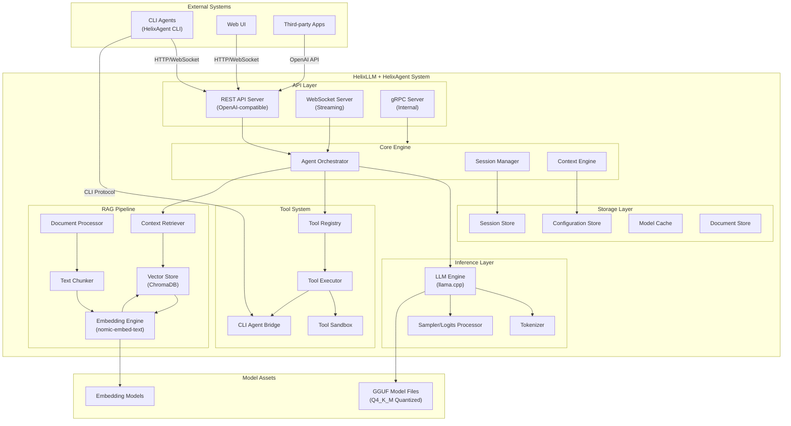
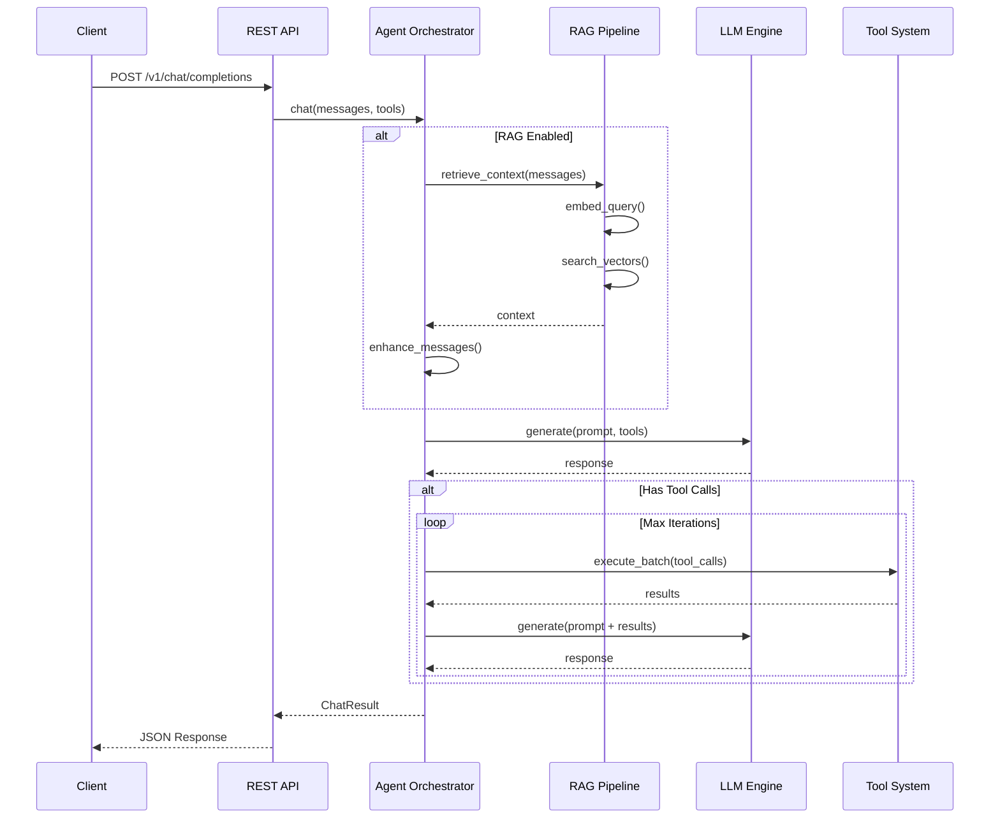
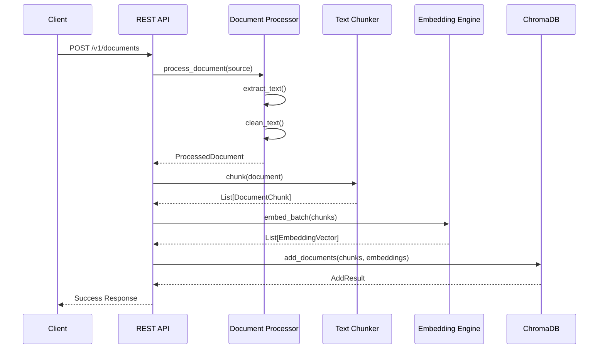
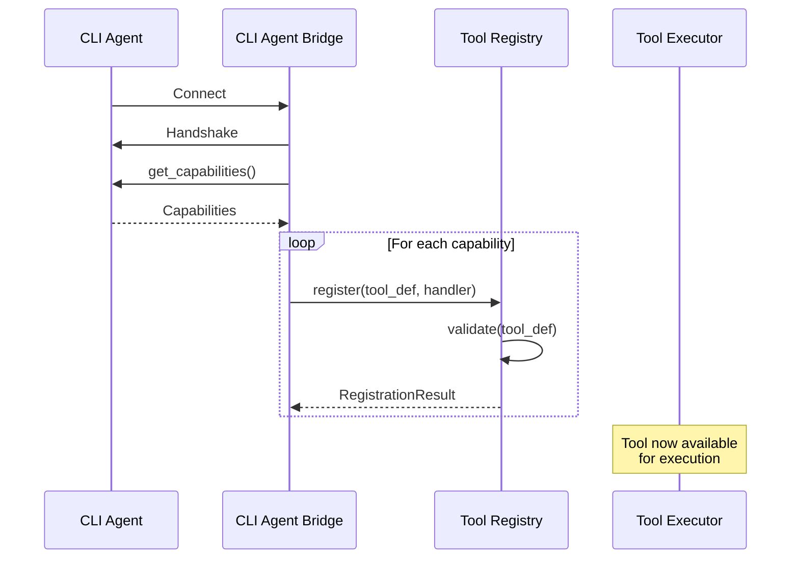

# HelixLLM + HelixAgent System Architecture
## Complete Production-Ready Design Document

**Version:** 1.0  
**Date:** 2024  
**Target Hardware:** AMD Ryzen 9, 32GB RAM, RTX 6GB VRAM  
**Model:** 1.5B Parameter LLM (Q4_K_M quantized)  
**Expected Performance:** 150-300+ tokens/second

---

## Table of Contents
1. [Executive Summary](#executive-summary)
2. [High-Level Architecture](#high-level-architecture)
3. [Component Breakdown](#component-breakdown)
4. [Interface Definitions](#interface-definitions)
5. [Data Flows](#data-flows)
6. [Integration Points](#integration-points)
7. [Configuration System](#configuration-system)
8. [Deployment Architecture](#deployment-architecture)

---

## Executive Summary

This document defines the complete system architecture for integrating HelixLLM (local LLM inference engine) with HelixAgent (agent orchestration framework). The system enables:

- **Local LLM Inference** via llama.cpp with GPU acceleration
- **Retrieval-Augmented Generation (RAG)** with ChromaDB vector store
- **Function Calling/Tool Use** with dynamic tool registry
- **OpenAI-Compatible API** for seamless integration
- **Agent Orchestration** for complex multi-step tasks
- **CLI Agent Support** for external tool integration

---

## High-Level Architecture

### System Context Diagram



### Component Interaction Diagram

```mermaid
flowchart LR
    subgraph RequestFlow["Request Processing Flow"]
        direction TB

        REQ["Incoming Request"]
        ROUTE["Request Router"]
        AUTH["Auth Middleware"]
        RATE["Rate Limiter"]

        REQ --> ROUTE --> AUTH --> RATE
    end

    subgraph Processing["Processing Pipeline"]
        direction TB

        PRE["Pre-processor"]
        RAG["RAG Enhancement"]
        TOOL["Tool Detection"]
        INF["Inference"]
        POST["Post-processor"]

        PRE --> RAG --> TOOL --> INF --> POST
    end

    subgraph Response["Response Generation"]
        direction TB

        STREAM["Stream Handler"]
        FORMAT["Response Formatter"]
        OUT["Output"]

        STREAM --> FORMAT --> OUT
    end

    RATE --> PRE
    POST --> STREAM
```



---

## Component Breakdown

### 1. Model Inference Layer (llama.cpp Integration)

#### 1.1 LLM Engine

**Responsibilities:**
- Load and manage GGUF model files
- Handle tokenization and detokenization
- Execute inference with GPU acceleration
- Manage KV cache for context windows
- Support batching for concurrent requests
- Implement grammar/constrained decoding

**Implementation Details:**
```python
class LLMEngine:
    """
    Core LLM inference engine using llama.cpp bindings
    """

    def __init__(self, config: ModelConfig):
        self.model_path: str = config.model_path
        self.n_ctx: int = config.context_length  # 4096-8192
        self.n_gpu_layers: int = config.gpu_layers  # -1 for all
        self.n_threads: int = config.cpu_threads  # 8-16 for Ryzen 9
        self.batch_size: int = config.batch_size  # 512-2048
        self.model: Optional[llama_cpp.Llama] = None
        self.kv_cache: KVCacheManager = KVCacheManager()

    async def load_model(self) -> LoadResult:
        """Load model into memory with specified parameters"""
        pass

    async def generate(
        self,
        prompt: str,
        params: GenerationParams,
        callback: Optional[TokenCallback] = None
    ) -> GenerationResult:
        """Generate text with streaming support"""
        pass

    async def generate_batch(
        self,
        prompts: List[str],
        params: GenerationParams
    ) -> List[GenerationResult]:
        """Batch generation for efficiency"""
        pass

    def tokenize(self, text: str) -> List[int]:
        """Convert text to token IDs"""
        pass

    def detokenize(self, tokens: List[int]) -> str:
        """Convert token IDs to text"""
        pass

    def get_token_count(self, text: str) -> int:
        """Get token count without full tokenization"""
        pass
```

#### 1.2 Tokenizer

**Responsibilities:**
- Text-to-token conversion
- Special token handling
- Chat template application
- Token counting for context management

```python
class Tokenizer:
    """
    Tokenization manager with chat template support
    """

    def __init__(self, model_path: str):
        self.encoder = tiktoken.Encoding(...)  # or HuggingFace tokenizer
        self.chat_template: str = self._load_chat_template()
        self.special_tokens: Dict[str, int] = {
            "<|im_start|>": 32001,
            "<|im_end|>": 32002,
            "<|tool_call|>": 32003,
            "<|tool_result|>": 32004,
        }

    def apply_chat_template(
        self,
        messages: List[ChatMessage],
        tools: Optional[List[ToolDefinition]] = None
    ) -> str:
        """Apply chat template to messages"""
        pass

    def encode(self, text: str, add_special_tokens: bool = True) -> List[int]:
        """Encode text to tokens"""
        pass

    def decode(self, tokens: List[int], skip_special_tokens: bool = True) -> str:
        """Decode tokens to text"""
        pass

    def count_tokens(self, text: str) -> int:
        """Fast token counting"""
        pass
```

#### 1.3 Sampler / Logits Processor

**Responsibilities:**
- Temperature scaling
- Top-p (nucleus) sampling
- Top-k sampling
- Repetition penalty
- Grammar-constrained decoding

```python
class LogitsProcessor:
    """
    Logits processing and sampling strategies
    """

    def __init__(self, config: SamplerConfig):
        self.temperature: float = config.temperature
        self.top_p: float = config.top_p
        self.top_k: int = config.top_k
        self.repetition_penalty: float = config.repetition_penalty
        self.grammar: Optional[GrammarConstraint] = None

    def process(self, logits: torch.Tensor, context: List[int]) -> torch.Tensor:
        """Apply all logits processors in sequence"""
        logits = self._apply_temperature(logits)
        logits = self._apply_top_p(logits)
        logits = self._apply_top_k(logits)
        logits = self._apply_repetition_penalty(logits, context)
        if self.grammar:
            logits = self.grammar.apply(logits)
        return logits

    def sample(self, logits: torch.Tensor) -> int:
        """Sample token from processed logits"""
        pass
```

---

### 2. Embedding Pipeline

#### 2.1 Document Processor

**Responsibilities:**
- Ingest documents from various sources (files, URLs, text)
- Extract text from different formats (PDF, DOCX, TXT, MD)
- Preprocess and clean text
- Track document metadata and versioning

```python
class DocumentProcessor:
    """
    Document ingestion and preprocessing pipeline
    """

    SUPPORTED_FORMATS = [".txt", ".md", ".pdf", ".docx", ".html", ".json"]

    def __init__(self, config: ProcessorConfig):
        self.extractors: Dict[str, TextExtractor] = {
            ".pdf": PDFExtractor(),
            ".docx": DocxExtractor(),
            ".html": HTMLExtractor(),
            ".md": MarkdownExtractor(),
        }
        self.cleaner = TextCleaner()
        self.metadata_extractor = MetadataExtractor()

    async def process_document(
        self,
        source: DocumentSource,
        options: ProcessingOptions = None
    ) -> ProcessedDocument:
        """
        Process a document through the full pipeline

        Args:
            source: Document source (file path, URL, or raw text)
            options: Processing options

        Returns:
            ProcessedDocument with extracted text and metadata
        """
        # Extract raw text
        raw_text = await self._extract_text(source)

        # Clean and normalize
        clean_text = self.cleaner.clean(raw_text)

        # Extract metadata
        metadata = self.metadata_extractor.extract(source, clean_text)

        return ProcessedDocument(
            id=generate_uuid(),
            content=clean_text,
            metadata=metadata,
            source=source,
            processed_at=datetime.utcnow()
        )

    async def batch_process(
        self,
        sources: List[DocumentSource],
        max_workers: int = 4
    ) -> List[ProcessedDocument]:
        """Process multiple documents in parallel"""
        pass
```

#### 2.2 Text Chunker

**Responsibilities:**
- Split documents into optimal chunks
- Preserve semantic boundaries
- Manage chunk overlap for context continuity
- Support multiple chunking strategies

```python
class TextChunker:
    """
    Intelligent text chunking with multiple strategies
    """

    def __init__(self, config: ChunkerConfig):
        self.strategy: ChunkingStrategy = config.strategy
        self.chunk_size: int = config.chunk_size  # 512-1024 tokens
        self.chunk_overlap: int = config.chunk_overlap  # 50-100 tokens
        self.tokenizer: Tokenizer = config.tokenizer

    def chunk(
        self,
        document: ProcessedDocument,
        strategy: Optional[ChunkingStrategy] = None
    ) -> List[DocumentChunk]:
        """
        Split document into chunks

        Strategies:
        - FIXED: Fixed-size chunks with overlap
        - SEMANTIC: Split on semantic boundaries (paragraphs, sections)
        - RECURSIVE: Hierarchical splitting
        - TOKEN: Token-aware chunking
        """
        strategy = strategy or self.strategy

        if strategy == ChunkingStrategy.FIXED:
            return self._fixed_chunk(document)
        elif strategy == ChunkingStrategy.SEMANTIC:
            return self._semantic_chunk(document)
        elif strategy == ChunkingStrategy.RECURSIVE:
            return self._recursive_chunk(document)
        else:
            return self._token_chunk(document)

    def _semantic_chunk(self, document: ProcessedDocument) -> List[DocumentChunk]:
        """Chunk based on semantic boundaries"""
        # Split on headers, paragraphs, sentences
        # Use NLP to identify boundaries
        pass

    def _fixed_chunk(self, document: ProcessedDocument) -> List[DocumentChunk]:
        """Fixed-size token-based chunking"""
        tokens = self.tokenizer.encode(document.content)
        chunks = []

        for i in range(0, len(tokens), self.chunk_size - self.chunk_overlap):
            chunk_tokens = tokens[i:i + self.chunk_size]
            chunk_text = self.tokenizer.decode(chunk_tokens)

            chunks.append(DocumentChunk(
                id=generate_uuid(),
                document_id=document.id,
                content=chunk_text,
                token_count=len(chunk_tokens),
                start_index=i,
                end_index=i + len(chunk_tokens),
                metadata={
                    **document.metadata,
                    "chunk_index": len(chunks),
                }
            ))

        return chunks
```

#### 2.3 Embedding Engine

**Responsibilities:**
- Generate embeddings using nomic-embed-text-v1.5
- Batch embedding for efficiency
- Cache frequently used embeddings
- Support multiple embedding models

```python
class EmbeddingEngine:
    """
    Embedding generation engine using nomic-embed-text
    """

    EMBEDDING_DIM = 768  # nomic-embed-text-v1.5
    MAX_BATCH_SIZE = 32

    def __init__(self, config: EmbeddingConfig):
        self.model_name: str = config.model_name or "nomic-ai/nomic-embed-text-v1.5"
        self.model_path: str = config.model_path
        self.device: str = config.device  # "cuda" or "cpu"
        self.normalize: bool = config.normalize  # True for cosine similarity

        # Load model
        self.model = self._load_model()
        self.tokenizer = self._load_tokenizer()

        # Cache
        self.cache: EmbeddingCache = EmbeddingCache(
            max_size=config.cache_size,
            ttl=config.cache_ttl
        )

    def _load_model(self) -> torch.nn.Module:
        """Load embedding model with optimizations"""
        from sentence_transformers import SentenceTransformer

        model = SentenceTransformer(self.model_path or self.model_name)

        if self.device == "cuda" and torch.cuda.is_available():
            model = model.to("cuda")

        # Enable optimizations
        model.eval()
        if hasattr(torch, 'compile'):
            model = torch.compile(model, mode="reduce-overhead")

        return model

    async def embed(
        self,
        texts: Union[str, List[str]],
        task_type: EmbeddingTask = EmbeddingTask.SEARCH_DOCUMENT
    ) -> Union[EmbeddingVector, List[EmbeddingVector]]:
        """
        Generate embeddings for text(s)

        Args:
            texts: Single text or list of texts
            task_type: Type of embedding task (affects prefix)

        Returns:
            Embedding vector(s) with dimension 768
        """
        is_single = isinstance(texts, str)
        texts = [texts] if is_single else texts

        # Add task-specific prefix
        prefixed_texts = [self._add_prefix(t, task_type) for t in texts]

        # Check cache
        cached_results = []
        texts_to_embed = []
        text_indices = []

        for i, text in enumerate(prefixed_texts):
            cache_key = self._compute_hash(text)
            if cache_key in self.cache:
                cached_results.append((i, self.cache[cache_key]))
            else:
                texts_to_embed.append(text)
                text_indices.append(i)

        # Generate embeddings for uncached texts
        if texts_to_embed:
            new_embeddings = await self._embed_batch(texts_to_embed)

            # Update cache
            for text, embedding in zip(texts_to_embed, new_embeddings):
                cache_key = self._compute_hash(text)
                self.cache[cache_key] = embedding
        else:
            new_embeddings = []

        # Reconstruct results in original order
        results = [None] * len(texts)
        for idx, emb in cached_results:
            results[idx] = emb
        for idx, emb in zip(text_indices, new_embeddings):
            results[idx] = emb

        return results[0] if is_single else results

    async def _embed_batch(self, texts: List[str]) -> List[EmbeddingVector]:
        """Internal batch embedding with GPU acceleration"""
        embeddings = self.model.encode(
            texts,
            batch_size=self.MAX_BATCH_SIZE,
            show_progress_bar=False,
            convert_to_tensor=True,
            normalize_embeddings=self.normalize
        )

        if self.device == "cuda":
            embeddings = embeddings.cpu()

        return embeddings.numpy().tolist()

    def _add_prefix(self, text: str, task_type: EmbeddingTask) -> str:
        """Add task-specific prefix for nomic-embed-text"""
        prefixes = {
            EmbeddingTask.SEARCH_DOCUMENT: "search_document: ",
            EmbeddingTask.SEARCH_QUERY: "search_query: ",
            EmbeddingTask.CLUSTERING: "clustering: ",
            EmbeddingTask.CLASSIFICATION: "classification: ",
        }
        return prefixes.get(task_type, "") + text
```

---

### 3. Vector Store (ChromaDB Integration)

#### 3.1 ChromaDB Manager

**Responsibilities:**
- Manage ChromaDB collections
- Handle vector CRUD operations
- Execute similarity search with filtering
- Manage index optimization

```python
class ChromaDBManager:
    """
    ChromaDB vector store manager
    """

    def __init__(self, config: ChromaConfig):
        self.persist_directory: str = config.persist_directory
        self.collection_name: str = config.collection_name
        self.distance_metric: str = config.distance_metric  # "cosine", "l2", "ip"

        # Initialize ChromaDB client
        self.client = chromadb.PersistentClient(path=self.persist_directory)

        # Get or create collection
        self.collection = self.client.get_or_create_collection(
            name=self.collection_name,
            metadata={"hnsw:space": self.distance_metric}
        )

    async def add_documents(
        self,
        documents: List[DocumentChunk],
        embeddings: List[EmbeddingVector]
    ) -> AddResult:
        """
        Add documents with embeddings to the vector store

        Args:
            documents: List of document chunks
            embeddings: Corresponding embedding vectors

        Returns:
            AddResult with IDs and status
        """
        ids = [doc.id for doc in documents]
        texts = [doc.content for doc in documents]
        metadatas = [doc.metadata for doc in documents]

        self.collection.add(
            ids=ids,
            documents=texts,
            embeddings=embeddings,
            metadatas=metadatas
        )

        return AddResult(
            ids=ids,
            count=len(documents),
            success=True
        )

    async def search(
        self,
        query_embedding: EmbeddingVector,
        top_k: int = 5,
        filter_dict: Optional[Dict] = None,
        min_similarity: Optional[float] = None
    ) -> List[SearchResult]:
        """
        Search for similar documents

        Args:
            query_embedding: Query embedding vector
            top_k: Number of results to return
            filter_dict: Metadata filter (e.g., {"source": "docs"})
            min_similarity: Minimum similarity threshold

        Returns:
            List of search results with scores
        """
        results = self.collection.query(
            query_embeddings=[query_embedding],
            n_results=top_k,
            where=filter_dict,
            include=["documents", "metadatas", "distances"]
        )

        search_results = []
        for i, doc_id in enumerate(results["ids"][0]):
            distance = results["distances"][0][i]
            similarity = self._distance_to_similarity(distance)

            if min_similarity and similarity < min_similarity:
                continue

            search_results.append(SearchResult(
                id=doc_id,
                content=results["documents"][0][i],
                metadata=results["metadatas"][0][i],
                similarity=similarity,
                distance=distance
            ))

        return search_results

    async def delete(
        self,
        ids: Optional[List[str]] = None,
        filter_dict: Optional[Dict] = None
    ) -> DeleteResult:
        """Delete documents by ID or filter"""
        if ids:
            self.collection.delete(ids=ids)
        elif filter_dict:
            self.collection.delete(where=filter_dict)
        else:
            raise ValueError("Must provide ids or filter_dict")

        return DeleteResult(success=True)

    def _distance_to_similarity(self, distance: float) -> float:
        """Convert distance to similarity score"""
        if self.distance_metric == "cosine":
            return 1 - distance  # Cosine distance to similarity
        elif self.distance_metric == "ip":
            return distance  # Inner product is already similarity
        else:
            return 1 / (1 + distance)  # L2 distance conversion
```

#### 3.2 Context Retriever

**Responsibilities:**
- Orchestrate query embedding and search
- Rerank results for relevance
- Format context for LLM consumption
- Manage context window budget

```python
class ContextRetriever:
    """
    RAG context retrieval orchestrator
    """

    def __init__(self, config: RetrieverConfig):
        self.embedding_engine: EmbeddingEngine = config.embedding_engine
        self.vector_store: ChromaDBManager = config.vector_store
        self.reranker: Optional[Reranker] = config.reranker
        self.max_context_tokens: int = config.max_context_tokens  # 1500-2000
        self.tokenizer: Tokenizer = config.tokenizer

    async def retrieve(
        self,
        query: str,
        top_k: int = 5,
        filter_dict: Optional[Dict] = None,
        rerank: bool = True
    ) -> RetrievalResult:
        """
        Retrieve relevant context for a query

        Args:
            query: User query
            top_k: Number of documents to retrieve
            filter_dict: Optional metadata filter
            rerank: Whether to rerank results

        Returns:
            RetrievalResult with formatted context
        """
        # Generate query embedding
        query_embedding = await self.embedding_engine.embed(
            query,
            task_type=EmbeddingTask.SEARCH_QUERY
        )

        # Search vector store
        results = await self.vector_store.search(
            query_embedding=query_embedding,
            top_k=top_k * 2 if rerank else top_k,  # Retrieve more for reranking
            filter_dict=filter_dict
        )

        # Rerank if enabled
        if rerank and self.reranker:
            results = await self.reranker.rerank(query, results, top_k=top_k)

        # Format context within token budget
        formatted_context = self._format_context(results)

        return RetrievalResult(
            context=formatted_context,
            sources=results,
            total_tokens=self.tokenizer.count_tokens(formatted_context),
            source_count=len(results)
        )

    def _format_context(self, results: List[SearchResult]) -> str:
        """Format search results into context string"""
        context_parts = []
        total_tokens = 0

        for i, result in enumerate(results):
            # Format each result
            part = f"\n[Document {i+1}]\n{result.content}\n"
            part_tokens = self.tokenizer.count_tokens(part)

            # Check token budget
            if total_tokens + part_tokens > self.max_context_tokens:
                break

            context_parts.append(part)
            total_tokens += part_tokens

        return "\n".join(context_parts)
```

---

### 4. Tool Registry & Execution Engine

#### 4.1 Tool Registry

**Responsibilities:**
- Register and manage available tools
- Validate tool definitions
- Provide tool discovery
- Manage tool schemas

```python
class ToolRegistry:
    """
    Central registry for all available tools
    """

    def __init__(self):
        self._tools: Dict[str, RegisteredTool] = {}
        self._categories: Dict[str, List[str]] = {}
        self._lock = asyncio.Lock()

    async def register(
        self,
        tool: ToolDefinition,
        handler: ToolHandler,
        category: str = "general"
    ) -> RegistrationResult:
        """
        Register a new tool

        Args:
            tool: Tool definition with schema
            handler: Async function to execute the tool
            category: Tool category for organization

        Returns:
            RegistrationResult with status
        """
        async with self._lock:
            # Validate tool definition
            validation = self._validate_tool(tool)
            if not validation.valid:
                return RegistrationResult(
                    success=False,
                    error=validation.error
                )

            # Register tool
            self._tools[tool.name] = RegisteredTool(
                definition=tool,
                handler=handler,
                category=category,
                registered_at=datetime.utcnow()
            )

            # Update categories
            if category not in self._categories:
                self._categories[category] = []
            self._categories[category].append(tool.name)

            return RegistrationResult(success=True, tool_name=tool.name)

    async def unregister(self, tool_name: str) -> bool:
        """Unregister a tool"""
        async with self._lock:
            if tool_name in self._tools:
                tool = self._tools.pop(tool_name)
                self._categories[tool.category].remove(tool_name)
                return True
            return False

    def get_tool(self, tool_name: str) -> Optional[RegisteredTool]:
        """Get a registered tool by name"""
        return self._tools.get(tool_name)

    def list_tools(
        self,
        category: Optional[str] = None
    ) -> List[ToolDefinition]:
        """List all registered tools, optionally filtered by category"""
        if category:
            tool_names = self._categories.get(category, [])
            return [self._tools[name].definition for name in tool_names]
        else:
            return [tool.definition for tool in self._tools.values()]

    def get_openai_schema(self) -> List[Dict]:
        """Get tools in OpenAI function calling format"""
        return [
            {
                "type": "function",
                "function": {
                    "name": tool.definition.name,
                    "description": tool.definition.description,
                    "parameters": tool.definition.parameters_schema
                }
            }
            for tool in self._tools.values()
        ]

    def _validate_tool(self, tool: ToolDefinition) -> ValidationResult:
        """Validate tool definition schema"""
        # Validate JSON schema
        try:
            jsonschema.Draft7Validator.check_schema(tool.parameters_schema)
        except jsonschema.SchemaError as e:
            return ValidationResult(valid=False, error=str(e))

        # Validate name format
        if not re.match(r"^[a-zA-Z0-9_-]+$", tool.name):
            return ValidationResult(
                valid=False,
                error="Tool name must be alphanumeric with underscores/hyphens"
            )

        return ValidationResult(valid=True)
```

#### 4.2 Tool Executor

**Responsibilities:**
- Execute tool calls safely
- Handle async execution
- Manage timeouts and retries
- Collect and format results

```python
class ToolExecutor:
    """
    Tool execution engine with safety and error handling
    """

    def __init__(self, config: ExecutorConfig):
        self.registry: ToolRegistry = config.registry
        self.timeout_seconds: float = config.timeout_seconds  # 30-60s
        self.max_retries: int = config.max_retries  # 1-3
        self.sandbox: Optional[ToolSandbox] = config.sandbox

    async def execute(
        self,
        tool_call: ToolCall,
        context: ExecutionContext
    ) -> ToolResult:
        """
        Execute a tool call

        Args:
            tool_call: Tool call with name and arguments
            context: Execution context (session, user, etc.)

        Returns:
            ToolResult with output or error
        """
        # Get tool from registry
        registered_tool = self.registry.get_tool(tool_call.name)
        if not registered_tool:
            return ToolResult(
                success=False,
                error=f"Tool '{tool_call.name}' not found"
            )

        # Validate arguments
        validation = self._validate_arguments(
            tool_call.arguments,
            registered_tool.definition.parameters_schema
        )
        if not validation.valid:
            return ToolResult(
                success=False,
                error=f"Invalid arguments: {validation.error}"
            )

        # Execute with timeout and retries
        for attempt in range(self.max_retries + 1):
            try:
                result = await asyncio.wait_for(
                    self._execute_tool(
                        registered_tool.handler,
                        tool_call.arguments,
                        context
                    ),
                    timeout=self.timeout_seconds
                )

                return ToolResult(
                    success=True,
                    data=result,
                    tool_name=tool_call.name,
                    execution_time=time.time() - context.start_time
                )

            except asyncio.TimeoutError:
                if attempt == self.max_retries:
                    return ToolResult(
                        success=False,
                        error=f"Tool execution timed out after {self.timeout_seconds}s"
                    )

            except Exception as e:
                if attempt == self.max_retries:
                    return ToolResult(
                        success=False,
                        error=f"Tool execution failed: {str(e)}"
                    )

                await asyncio.sleep(2 ** attempt)  # Exponential backoff

    async def execute_batch(
        self,
        tool_calls: List[ToolCall],
        context: ExecutionContext
    ) -> List[ToolResult]:
        """Execute multiple tool calls in parallel"""
        tasks = [
            self.execute(call, context)
            for call in tool_calls
        ]
        return await asyncio.gather(*tasks)

    async def _execute_tool(
        self,
        handler: ToolHandler,
        arguments: Dict,
        context: ExecutionContext
    ) -> Any:
        """Internal tool execution"""
        if self.sandbox:
            return await self.sandbox.execute(handler, arguments, context)
        else:
            return await handler(arguments, context)
```

#### 4.3 CLI Agent Bridge

**Responsibilities:**
- Connect to external CLI agents
- Translate between internal and CLI protocols
- Manage agent lifecycle
- Handle bidirectional communication

```python
class CLIAgentBridge:
    """
    Bridge for external CLI agent integration
    """

    def __init__(self, config: BridgeConfig):
        self.agent_path: str = config.agent_path
        self.protocol: CLIProtocol = config.protocol
        self.env_vars: Dict[str, str] = config.env_vars
        self.process: Optional[asyncio.subprocess.Process] = None
        self._lock = asyncio.Lock()

    async def connect(self) -> ConnectionResult:
        """Establish connection to CLI agent"""
        async with self._lock:
            if self.process:
                return ConnectionResult(success=True, already_connected=True)

            self.process = await asyncio.create_subprocess_exec(
                self.agent_path,
                stdin=asyncio.subprocess.PIPE,
                stdout=asyncio.subprocess.PIPE,
                stderr=asyncio.subprocess.PIPE,
                env={**os.environ, **self.env_vars}
            )

            # Perform handshake
            handshake = await self._handshake()

            return ConnectionResult(
                success=handshake.success,
                agent_info=handshake.agent_info
            )

    async def invoke(
        self,
        action: str,
        parameters: Dict[str, Any]
    ) -> AgentResponse:
        """
        Invoke an action on the CLI agent

        Args:
            action: Action name
            parameters: Action parameters

        Returns:
            Agent response
        """
        if not self.process:
            await self.connect()

        # Build request
        request = AgentRequest(
            action=action,
            parameters=parameters,
            request_id=generate_uuid()
        )

        # Send request
        await self._send_request(request)

        # Wait for response
        response = await self._receive_response(timeout=60)

        return response

    async def register_tools(self, registry: ToolRegistry) -> None:
        """Register CLI agent capabilities as tools"""
        # Query agent for capabilities
        capabilities = await self.invoke("get_capabilities", {})

        for capability in capabilities.data:
            tool_def = ToolDefinition(
                name=f"cli_{capability['name']}",
                description=capability['description'],
                parameters_schema=capability['parameters']
            )

            # Create handler that invokes CLI agent
            async def handler(args, context):
                return await self.invoke(capability['name'], args)

            await registry.register(tool_def, handler, category="cli_agents")

    async def disconnect(self) -> None:
        """Disconnect from CLI agent"""
        async with self._lock:
            if self.process:
                self.process.terminate()
                await self.process.wait()
                self.process = None
```

---

### 5. API Layer (OpenAI-Compatible)

#### 5.1 REST API Server

**Responsibilities:**
- Expose OpenAI-compatible endpoints
- Handle authentication and rate limiting
- Manage request/response serialization
- Support streaming responses

```python
class RESTAPIServer:
    """
    OpenAI-compatible REST API server
    """

    def __init__(self, config: APIConfig):
        self.app = FastAPI(title="HelixLLM API", version="1.0.0")
        self.config = config
        self.orchestrator: AgentOrchestrator = config.orchestrator

        # Setup middleware
        self._setup_middleware()

        # Setup routes
        self._setup_routes()

    def _setup_middleware(self):
        """Configure API middleware"""
        # CORS
        self.app.add_middleware(
            CORSMiddleware,
            allow_origins=self.config.allowed_origins,
            allow_credentials=True,
            allow_methods=["*"],
            allow_headers=["*"],
        )

        # Authentication
        self.app.add_middleware(
            AuthMiddleware,
            api_keys=self.config.api_keys,
            auth_enabled=self.config.auth_enabled
        )

        # Rate limiting
        self.app.add_middleware(
            RateLimitMiddleware,
            requests_per_minute=self.config.rate_limit
        )

    def _setup_routes(self):
        """Configure API routes"""

        @self.app.post("/v1/chat/completions")
        async def chat_completions(request: ChatCompletionRequest):
            """OpenAI-compatible chat completions endpoint"""

            if request.stream:
                return StreamingResponse(
                    self._stream_chat_completion(request),
                    media_type="text/event-stream"
                )
            else:
                return await self._chat_completion(request)

        @self.app.post("/v1/completions")
        async def completions(request: CompletionRequest):
            """OpenAI-compatible completions endpoint"""
            pass

        @self.app.post("/v1/embeddings")
        async def embeddings(request: EmbeddingRequest):
            """OpenAI-compatible embeddings endpoint"""
            results = await self.orchestrator.embed(request.input)
            return {
                "object": "list",
                "data": [
                    {
                        "object": "embedding",
                        "embedding": emb,
                        "index": i
                    }
                    for i, emb in enumerate(results)
                ],
                "model": request.model,
                "usage": {
                    "prompt_tokens": sum(len(inp) for inp in request.input),
                    "total_tokens": sum(len(inp) for inp in request.input)
                }
            }

        @self.app.get("/v1/models")
        async def list_models():
            """List available models"""
            return {
                "object": "list",
                "data": [
                    {
                        "id": self.config.model_id,
                        "object": "model",
                        "created": int(time.time()),
                        "owned_by": "helixllm"
                    }
                ]
            }

    async def _chat_completion(
        self,
        request: ChatCompletionRequest
    ) -> ChatCompletionResponse:
        """Non-streaming chat completion"""

        result = await self.orchestrator.chat(
            messages=request.messages,
            tools=request.tools,
            tool_choice=request.tool_choice,
            temperature=request.temperature,
            max_tokens=request.max_tokens,
            top_p=request.top_p,
            stop=request.stop,
        )

        return ChatCompletionResponse(
            id=f"chatcmpl-{generate_uuid()}",
            object="chat.completion",
            created=int(time.time()),
            model=request.model,
            choices=[
                {
                    "index": 0,
                    "message": {
                        "role": "assistant",
                        "content": result.content,
                        "tool_calls": result.tool_calls
                    },
                    "finish_reason": result.finish_reason
                }
            ],
            usage={
                "prompt_tokens": result.prompt_tokens,
                "completion_tokens": result.completion_tokens,
                "total_tokens": result.total_tokens
            }
        )

    async def _stream_chat_completion(
        self,
        request: ChatCompletionRequest
    ) -> AsyncGenerator[str, None]:
        """Streaming chat completion"""

        request_id = f"chatcmpl-{generate_uuid()}"
        created = int(time.time())

        async for chunk in self.orchestrator.chat_stream(
            messages=request.messages,
            tools=request.tools,
            temperature=request.temperature,
            max_tokens=request.max_tokens,
        ):
            data = {
                "id": request_id,
                "object": "chat.completion.chunk",
                "created": created,
                "model": request.model,
                "choices": [
                    {
                        "index": 0,
                        "delta": chunk.delta,
                        "finish_reason": chunk.finish_reason
                    }
                ]
            }

            yield f"data: {json.dumps(data)}\n\n"

        yield "data: [DONE]\n\n"
```

#### 5.2 WebSocket Server

**Responsibilities:**
- Real-time bidirectional communication
- Support for long-running conversations
- Push notifications for async events

```python
class WebSocketServer:
    """
    WebSocket server for real-time communication
    """

    def __init__(self, config: WSConfig):
        self.orchestrator: AgentOrchestrator = config.orchestrator
        self.active_connections: Dict[str, WebSocket] = {}

    async def handle_connection(self, websocket: WebSocket):
        """Handle new WebSocket connection"""
        await websocket.accept()

        session_id = generate_uuid()
        self.active_connections[session_id] = websocket

        try:
            while True:
                # Receive message
                message = await websocket.receive_json()

                # Process message
                response = await self._process_message(session_id, message)

                # Send response
                await websocket.send_json(response)

        except WebSocketDisconnect:
            del self.active_connections[session_id]

    async def _process_message(
        self,
        session_id: str,
        message: Dict
    ) -> Dict:
        """Process incoming WebSocket message"""

        msg_type = message.get("type")

        if msg_type == "chat":
            return await self._handle_chat_message(session_id, message)
        elif msg_type == "tool_call":
            return await self._handle_tool_call(session_id, message)
        elif msg_type == "rag_query":
            return await self._handle_rag_query(session_id, message)
        else:
            return {"error": f"Unknown message type: {msg_type}"}

    async def broadcast(self, message: Dict) -> None:
        """Broadcast message to all connections"""
        disconnected = []

        for session_id, ws in self.active_connections.items():
            try:
                await ws.send_json(message)
            except:
                disconnected.append(session_id)

        # Clean up disconnected
        for session_id in disconnected:
            del self.active_connections[session_id]
```

---

### 6. Agent Orchestration Layer

#### 6.1 Agent Orchestrator

**Responsibilities:**
- Coordinate all components for request processing
- Manage conversation flow
- Handle tool calling loops
- Integrate RAG when needed

```python
class AgentOrchestrator:
    """
    Central orchestrator for agent behavior
    """

    def __init__(self, config: OrchestratorConfig):
        self.llm_engine: LLMEngine = config.llm_engine
        self.tool_registry: ToolRegistry = config.tool_registry
        self.tool_executor: ToolExecutor = config.tool_executor
        self.retriever: Optional[ContextRetriever] = config.retriever
        self.session_manager: SessionManager = config.session_manager
        self.tokenizer: Tokenizer = config.tokenizer

        # Configuration
        self.max_tool_iterations: int = config.max_tool_iterations  # 5-10
        self.enable_rag: bool = config.enable_rag
        self.rag_trigger_keywords: List[str] = config.rag_trigger_keywords

    async def chat(
        self,
        messages: List[ChatMessage],
        tools: Optional[List[Dict]] = None,
        tool_choice: Optional[str] = "auto",
        temperature: float = 0.7,
        max_tokens: Optional[int] = None,
        top_p: float = 1.0,
        stop: Optional[List[str]] = None,
        session_id: Optional[str] = None,
    ) -> ChatResult:
        """
        Process chat request with full agent capabilities

        Args:
            messages: Conversation history
            tools: Available tools (uses registry if None)
            tool_choice: Tool choice mode ("auto", "none", "required", or specific)
            temperature: Sampling temperature
            max_tokens: Maximum tokens to generate
            top_p: Nucleus sampling parameter
            stop: Stop sequences
            session_id: Session ID for context persistence

        Returns:
            ChatResult with response and metadata
        """
        # Get or create session
        session = await self.session_manager.get_or_create(session_id)

        # Enhance with RAG if enabled
        if self.enable_rag and self._should_use_rag(messages):
            messages = await self._enhance_with_rag(messages)

        # Get available tools
        available_tools = tools or self.tool_registry.get_openai_schema()

        # Apply chat template
        prompt = self.tokenizer.apply_chat_template(messages, available_tools)

        # Generate initial response
        response = await self._generate(
            prompt=prompt,
            tools=available_tools if available_tools else None,
            temperature=temperature,
            max_tokens=max_tokens,
            top_p=top_p,
            stop=stop
        )

        # Handle tool calling loop
        iteration = 0
        current_messages = list(messages)

        while response.tool_calls and iteration < self.max_tool_iterations:
            iteration += 1

            # Add assistant message with tool calls
            current_messages.append(ChatMessage(
                role="assistant",
                content=response.content,
                tool_calls=response.tool_calls
            ))

            # Execute tools
            tool_results = await self.tool_executor.execute_batch(
                response.tool_calls,
                ExecutionContext(
                    session_id=session.id,
                    user_id=session.user_id,
                    start_time=time.time()
                )
            )

            # Add tool results to messages
            for result in tool_results:
                current_messages.append(ChatMessage(
                    role="tool",
                    tool_call_id=result.tool_call_id,
                    content=self._format_tool_result(result)
                ))

            # Generate follow-up response
            prompt = self.tokenizer.apply_chat_template(
                current_messages,
                available_tools
            )

            response = await self._generate(
                prompt=prompt,
                tools=available_tools if available_tools else None,
                temperature=temperature,
                max_tokens=max_tokens,
                top_p=top_p
            )

        # Update session
        await self.session_manager.update(session.id, current_messages)

        return ChatResult(
            content=response.content,
            tool_calls=response.tool_calls if iteration > 0 else None,
            finish_reason=response.finish_reason,
            prompt_tokens=response.prompt_tokens,
            completion_tokens=response.completion_tokens,
            total_tokens=response.total_tokens,
            session_id=session.id
        )

    async def chat_stream(
        self,
        messages: List[ChatMessage],
        tools: Optional[List[Dict]] = None,
        **kwargs
    ) -> AsyncGenerator[StreamChunk, None]:
        """Streaming chat completion"""

        # Similar to chat() but yields chunks
        result = await self.chat(messages, tools, **kwargs)

        # Stream content word by word
        words = result.content.split()
        for i, word in enumerate(words):
            yield StreamChunk(
                delta={"content": word + " "},
                finish_reason=None if i < len(words) - 1 else "stop"
            )

    async def embed(self, texts: Union[str, List[str]]) -> List[List[float]]:
        """Generate embeddings"""
        if isinstance(texts, str):
            texts = [texts]
        return await self.retriever.embedding_engine.embed(texts)

    def _should_use_rag(self, messages: List[ChatMessage]) -> bool:
        """Determine if RAG should be used for this query"""
        last_message = messages[-1].content.lower()

        # Check for RAG trigger keywords
        for keyword in self.rag_trigger_keywords:
            if keyword in last_message:
                return True

        # Check for question patterns
        question_patterns = [
            r"what is", r"how to", r"explain", r"tell me about",
            r"what are", r"how do", r"can you"
        ]

        for pattern in question_patterns:
            if re.search(pattern, last_message):
                return True

        return False

    async def _enhance_with_rag(
        self,
        messages: List[ChatMessage]
    ) -> List[ChatMessage]:
        """Enhance messages with RAG context"""

        # Get last user message
        last_message = messages[-1]

        # Retrieve relevant context
        retrieval = await self.retriever.retrieve(last_message.content)

        if retrieval.sources:
            # Create system message with context
            context_message = ChatMessage(
                role="system",
                content=f"""Use the following context to answer the user's question:

{retrieval.context}

Answer based on the context provided."""
            )

            # Insert context before last message
            enhanced = messages[:-1] + [context_message, last_message]
            return enhanced

        return messages
```

#### 6.2 Session Manager

**Responsibilities:**
- Manage conversation sessions
- Persist conversation history
- Handle session lifecycle

```python
class SessionManager:
    """
    Conversation session management
    """

    def __init__(self, config: SessionConfig):
        self.store: SessionStore = config.store
        self.ttl_seconds: int = config.ttl_seconds  # 3600 default
        self.max_history: int = config.max_history  # 100 messages

    async def get_or_create(
        self,
        session_id: Optional[str] = None
    ) -> Session:
        """Get existing session or create new one"""

        if session_id:
            session = await self.store.get(session_id)
            if session:
                return session

        # Create new session
        new_session = Session(
            id=session_id or generate_uuid(),
            created_at=datetime.utcnow(),
            updated_at=datetime.utcnow(),
            messages=[],
            metadata={}
        )

        await self.store.save(new_session)
        return new_session

    async def update(
        self,
        session_id: str,
        messages: List[ChatMessage]
    ) -> None:
        """Update session with new messages"""

        session = await self.store.get(session_id)
        if not session:
            raise SessionNotFoundError(session_id)

        # Trim history if needed
        if len(messages) > self.max_history:
            messages = messages[-self.max_history:]

        session.messages = messages
        session.updated_at = datetime.utcnow()

        await self.store.save(session)

    async def delete(self, session_id: str) -> bool:
        """Delete a session"""
        return await self.store.delete(session_id)
```

---

### 7. Configuration & Boot System

#### 7.1 Configuration Manager

```python
class ConfigurationManager:
    """
    Centralized configuration management
    """

    def __init__(self, config_path: Optional[str] = None):
        self.config_path = config_path or "config.yaml"
        self.config: Dict = {}
        self._load_config()

    def _load_config(self):
        """Load configuration from file and environment"""
        # Load from file
        if os.path.exists(self.config_path):
            with open(self.config_path) as f:
                self.config = yaml.safe_load(f)

        # Override with environment variables
        self._apply_env_overrides()

    def _apply_env_overrides(self):
        """Apply environment variable overrides"""
        env_mappings = {
            "HELIX_MODEL_PATH": "model.path",
            "HELIX_GPU_LAYERS": "model.gpu_layers",
            "HELIX_CONTEXT_LENGTH": "model.context_length",
            "HELIX_API_KEY": "api.key",
            "HELIX_RATE_LIMIT": "api.rate_limit",
            "HELIX_CHROMA_PATH": "storage.chroma_path",
        }

        for env_var, config_path in env_mappings.items():
            value = os.getenv(env_var)
            if value:
                self._set_nested(config_path, value)

    def get(self, path: str, default=None):
        """Get configuration value by path"""
        keys = path.split(".")
        value = self.config

        for key in keys:
            if isinstance(value, dict):
                value = value.get(key)
            else:
                return default

        return value if value is not None else default

    def get_model_config(self) -> ModelConfig:
        """Get model configuration"""
        return ModelConfig(
            path=self.get("model.path"),
            context_length=self.get("model.context_length", 4096),
            gpu_layers=self.get("model.gpu_layers", -1),
            cpu_threads=self.get("model.cpu_threads", 8),
            batch_size=self.get("model.batch_size", 512),
        )

    def get_api_config(self) -> APIConfig:
        """Get API configuration"""
        return APIConfig(
            host=self.get("api.host", "0.0.0.0"),
            port=self.get("api.port", 8000),
            api_keys=self.get("api.keys", []),
            auth_enabled=self.get("api.auth_enabled", False),
            rate_limit=self.get("api.rate_limit", 60),
        )
```

#### 7.2 Boot Sequence

```python
class ApplicationBootstrap:
    """
    Application bootstrap and initialization
    """

    def __init__(self):
        self.config: ConfigurationManager = None
        self.components: Dict[str, Any] = {}
        self.logger = logging.getLogger("helix.bootstrap")

    async def boot(self, config_path: Optional[str] = None) -> BootResult:
        """
        Bootstrap the entire application

        Returns:
            BootResult with initialized components
        """
        self.logger.info("Starting HelixLLM + HelixAgent bootstrap...")

        # 1. Load configuration
        self.config = ConfigurationManager(config_path)
        self.logger.info("Configuration loaded")

        # 2. Initialize storage
        await self._init_storage()
        self.logger.info("Storage initialized")

        # 3. Initialize embedding engine
        await self._init_embedding_engine()
        self.logger.info("Embedding engine initialized")

        # 4. Initialize vector store
        await self._init_vector_store()
        self.logger.info("Vector store initialized")

        # 5. Initialize LLM engine
        await self._init_llm_engine()
        self.logger.info("LLM engine initialized")

        # 6. Initialize tool registry
        await self._init_tool_registry()
        self.logger.info("Tool registry initialized")

        # 7. Initialize orchestrator
        await self._init_orchestrator()
        self.logger.info("Orchestrator initialized")

        # 8. Initialize API servers
        await self._init_api_servers()
        self.logger.info("API servers initialized")

        self.logger.info("Bootstrap complete!")

        return BootResult(
            success=True,
            components=self.components
        )

    async def _init_llm_engine(self):
        """Initialize LLM inference engine"""
        config = self.config.get_model_config()

        self.components["llm_engine"] = LLMEngine(config)
        await self.components["llm_engine"].load_model()

    async def _init_embedding_engine(self):
        """Initialize embedding engine"""
        config = EmbeddingConfig(
            model_path=self.config.get("embedding.model_path"),
            device=self.config.get("embedding.device", "cuda"),
        )

        self.components["embedding_engine"] = EmbeddingEngine(config)

    async def _init_vector_store(self):
        """Initialize vector store"""
        config = ChromaConfig(
            persist_directory=self.config.get("storage.chroma_path", "./chroma"),
            collection_name=self.config.get("storage.collection", "default"),
        )

        self.components["vector_store"] = ChromaDBManager(config)

    async def _init_tool_registry(self):
        """Initialize tool registry with built-in tools"""
        registry = ToolRegistry()

        # Register built-in tools
        await self._register_builtin_tools(registry)

        self.components["tool_registry"] = registry

    async def _init_orchestrator(self):
        """Initialize agent orchestrator"""
        config = OrchestratorConfig(
            llm_engine=self.components["llm_engine"],
            tool_registry=self.components["tool_registry"],
            tool_executor=ToolExecutor(ExecutorConfig(
                registry=self.components["tool_registry"]
            )),
            retriever=ContextRetriever(RetrieverConfig(
                embedding_engine=self.components["embedding_engine"],
                vector_store=self.components["vector_store"],
            )),
            session_manager=SessionManager(SessionConfig(
                store=self.components["session_store"]
            )),
        )

        self.components["orchestrator"] = AgentOrchestrator(config)

    async def _init_api_servers(self):
        """Initialize API servers"""
        api_config = self.config.get_api_config()
        api_config.orchestrator = self.components["orchestrator"]

        self.components["rest_api"] = RESTAPIServer(api_config)
        self.components["ws_api"] = WebSocketServer(WSConfig(
            orchestrator=self.components["orchestrator"]
        ))
```

---

## Interface Definitions

### Data Structures

```python
# Core data structures for inter-component communication

@dataclass
class ChatMessage:
    role: str  # "system", "user", "assistant", "tool"
    content: str
    name: Optional[str] = None
    tool_calls: Optional[List[ToolCall]] = None
    tool_call_id: Optional[str] = None

@dataclass
class ToolCall:
    id: str
    type: str = "function"
    function: Dict  # {"name": str, "arguments": str}

@dataclass
class ToolDefinition:
    name: str
    description: str
    parameters_schema: Dict  # JSON Schema

@dataclass
class ToolResult:
    success: bool
    data: Any = None
    error: Optional[str] = None
    tool_name: Optional[str] = None
    execution_time: Optional[float] = None

@dataclass
class GenerationParams:
    temperature: float = 0.7
    top_p: float = 1.0
    top_k: int = 40
    max_tokens: Optional[int] = None
    stop: Optional[List[str]] = None
    repetition_penalty: float = 1.0
    grammar: Optional[str] = None

@dataclass
class GenerationResult:
    text: str
    tokens_generated: int
    prompt_tokens: int
    finish_reason: str  # "stop", "length", "tool_call"
    tool_calls: Optional[List[ToolCall]] = None

@dataclass
class ProcessedDocument:
    id: str
    content: str
    metadata: Dict
    source: DocumentSource
    processed_at: datetime

@dataclass
class DocumentChunk:
    id: str
    document_id: str
    content: str
    token_count: int
    start_index: int
    end_index: int
    metadata: Dict

@dataclass
class SearchResult:
    id: str
    content: str
    metadata: Dict
    similarity: float
    distance: float

@dataclass
class RetrievalResult:
    context: str
    sources: List[SearchResult]
    total_tokens: int
    source_count: int

@dataclass
class ChatResult:
    content: str
    tool_calls: Optional[List[ToolCall]]
    finish_reason: str
    prompt_tokens: int
    completion_tokens: int
    total_tokens: int
    session_id: str

@dataclass
class StreamChunk:
    delta: Dict  # {"content": str} or {"tool_calls": [...]}
    finish_reason: Optional[str]
```

### Component Interfaces

```python
# LLM Engine Interface
class ILLMEngine(ABC):
    @abstractmethod
    async def load_model(self) -> LoadResult: ...

    @abstractmethod
    async def generate(
        self,
        prompt: str,
        params: GenerationParams,
        callback: Optional[TokenCallback] = None
    ) -> GenerationResult: ...

    @abstractmethod
    def tokenize(self, text: str) -> List[int]: ...

    @abstractmethod
    def detokenize(self, tokens: List[int]) -> str: ...

# Embedding Engine Interface
class IEmbeddingEngine(ABC):
    @abstractmethod
    async def embed(
        self,
        texts: Union[str, List[str]],
        task_type: EmbeddingTask = EmbeddingTask.SEARCH_DOCUMENT
    ) -> Union[EmbeddingVector, List[EmbeddingVector]]: ...

# Vector Store Interface
class IVectorStore(ABC):
    @abstractmethod
    async def add_documents(
        self,
        documents: List[DocumentChunk],
        embeddings: List[EmbeddingVector]
    ) -> AddResult: ...

    @abstractmethod
    async def search(
        self,
        query_embedding: EmbeddingVector,
        top_k: int = 5,
        filter_dict: Optional[Dict] = None
    ) -> List[SearchResult]: ...

    @abstractmethod
    async def delete(
        self,
        ids: Optional[List[str]] = None,
        filter_dict: Optional[Dict] = None
    ) -> DeleteResult: ...

# Tool Registry Interface
class IToolRegistry(ABC):
    @abstractmethod
    async def register(
        self,
        tool: ToolDefinition,
        handler: ToolHandler,
        category: str = "general"
    ) -> RegistrationResult: ...

    @abstractmethod
    def get_tool(self, tool_name: str) -> Optional[RegisteredTool]: ...

    @abstractmethod
    def list_tools(self, category: Optional[str] = None) -> List[ToolDefinition]: ...

    @abstractmethod
    def get_openai_schema(self) -> List[Dict]: ...

# Orchestrator Interface
class IAgentOrchestrator(ABC):
    @abstractmethod
    async def chat(
        self,
        messages: List[ChatMessage],
        tools: Optional[List[Dict]] = None,
        **kwargs
    ) -> ChatResult: ...

    @abstractmethod
    async def chat_stream(
        self,
        messages: List[ChatMessage],
        tools: Optional[List[Dict]] = None,
        **kwargs
    ) -> AsyncGenerator[StreamChunk, None]: ...

    @abstractmethod
    async def embed(self, texts: Union[str, List[str]]) -> List[List[float]]: ...
```

---

## Data Flows

### 1. Chat Completion Flow



### 2. Document Ingestion Flow



### 3. Tool Registration Flow



---

## Integration Points

### HelixLLM to HelixAgent Integration

```python
# HelixLLM exposes capabilities to HelixAgent through:

class HelixLLMClient:
    """
    Client for HelixAgent to interact with HelixLLM
    """

    def __init__(self, base_url: str, api_key: Optional[str] = None):
        self.base_url = base_url
        self.api_key = api_key
        self.client = httpx.AsyncClient()

    async def chat(
        self,
        messages: List[Dict],
        tools: Optional[List[Dict]] = None
    ) -> Dict:
        """Send chat request to HelixLLM"""

        response = await self.client.post(
            f"{self.base_url}/v1/chat/completions",
            headers={"Authorization": f"Bearer {self.api_key}"},
            json={
                "model": "helix-1.5b",
                "messages": messages,
                "tools": tools,
                "tool_choice": "auto"
            }
        )

        return response.json()

    async def embed(self, texts: List[str]) -> List[List[float]]:
        """Get embeddings from HelixLLM"""

        response = await self.client.post(
            f"{self.base_url}/v1/embeddings",
            headers={"Authorization": f"Bearer {self.api_key}"},
            json={
                "model": "nomic-embed-text",
                "input": texts
            }
        )

        data = response.json()
        return [item["embedding"] for item in data["data"]]
```

### CLI Agent Protocol

```python
# Protocol for CLI agent communication

class CLIProtocol:
    """
    Protocol definition for CLI agent communication
    """

    VERSION = "1.0"

    @staticmethod
    def create_request(action: str, params: Dict) -> str:
        """Create protocol message"""
        return json.dumps({
            "version": CLIProtocol.VERSION,
            "type": "request",
            "action": action,
            "parameters": params,
            "timestamp": time.time()
        })

    @staticmethod
    def create_response(
        success: bool,
        data: Any = None,
        error: Optional[str] = None
    ) -> str:
        """Create protocol response"""
        return json.dumps({
            "version": CLIProtocol.VERSION,
            "type": "response",
            "success": success,
            "data": data,
            "error": error,
            "timestamp": time.time()
        })

    @staticmethod
    def parse_message(raw: str) -> Dict:
        """Parse protocol message"""
        return json.loads(raw)
```

---

## Deployment Architecture

### Docker Compose Configuration

```yaml
version: '3.8'

services:
  helixllm:
    build: .
    ports:
      - "8000:8000"
    volumes:
      - ./models:/app/models:ro
      - ./data:/app/data
      - ./config.yaml:/app/config.yaml:ro
    environment:
      - HELIX_MODEL_PATH=/app/models/helix-1.5b-q4_k_m.gguf
      - HELIX_GPU_LAYERS=-1
      - HELIX_CONTEXT_LENGTH=4096
    deploy:
      resources:
        reservations:
          devices:
            - driver: nvidia
              count: 1
              capabilities: [gpu]
    healthcheck:
      test: ["CMD", "curl", "-f", "http://localhost:8000/health"]
      interval: 30s
      timeout: 10s
      retries: 3

  chromadb:
    image: chromadb/chroma:latest
    volumes:
      - chroma_data:/chroma/chroma
    ports:
      - "8001:8000"

volumes:
  chroma_data:
```

### System Requirements

| Component | Minimum | Recommended |
|-----------|---------|-------------|
| CPU | 4 cores | AMD Ryzen 9 (16 cores) |
| RAM | 16 GB | 32 GB |
| GPU VRAM | 4 GB | 6+ GB (RTX 3060) |
| Storage | 10 GB SSD | 50 GB NVMe |
| Network | Local only | Gigabit Ethernet |

---

## Performance Optimizations

### 1. Model Loading
- Use memory-mapped files for model loading
- Enable GPU offloading for all layers (n_gpu_layers=-1)
- Use Q4_K_M quantization for 1.5B models

### 2. Inference Optimization
- Batch requests when possible
- Use continuous batching for concurrent requests
- Implement KV cache management
- Enable Flash Attention if supported

### 3. Embedding Optimization
- Batch embedding generation (max 32 texts)
- Cache frequently used embeddings
- Use GPU acceleration for embedding model

### 4. Vector Search Optimization
- Use HNSW index in ChromaDB
- Pre-filter by metadata when possible
- Cache recent search results

---

## Security Considerations

1. **API Authentication**: Use API keys for external access
2. **Rate Limiting**: Prevent abuse with request limits
3. **Input Validation**: Validate all inputs against schemas
4. **Sandboxing**: Execute tools in isolated environment
5. **Model Safety**: Implement content filtering
6. **Audit Logging**: Log all requests and tool executions

---

## Monitoring & Observability

```python
# Metrics to track
METRICS = {
    "llm": [
        "tokens_per_second",
        "time_to_first_token",
        "queue_depth",
        "kv_cache_usage",
    ],
    "embedding": [
        "embeddings_per_second",
        "cache_hit_rate",
        "batch_size",
    ],
    "vector_store": [
        "query_latency",
        "index_size",
        "search_results_count",
    ],
    "api": [
        "request_count",
        "request_latency",
        "error_rate",
        "active_connections",
    ]
}
```

---

## Conclusion

This architecture provides a complete, production-ready system for integrating HelixLLM with HelixAgent. The design emphasizes:

- **Modularity**: Each component has clear responsibilities
- **Scalability**: Supports concurrent requests and batching
- **Extensibility**: Easy to add new tools and capabilities
- **Performance**: Optimized for 150-300+ tokens/second on target hardware
- **Compatibility**: OpenAI-compatible API for seamless integration

The system is designed to run efficiently on consumer hardware (AMD Ryzen 9, 32GB RAM, RTX 6GB) while providing enterprise-grade features like RAG, tool use, and agent orchestration.
