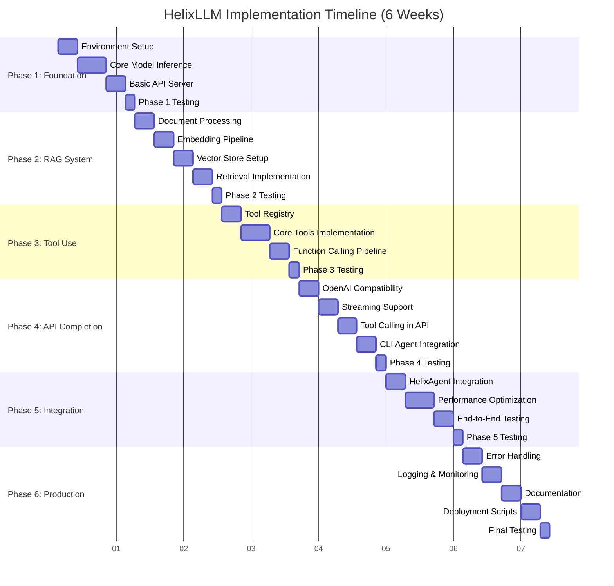
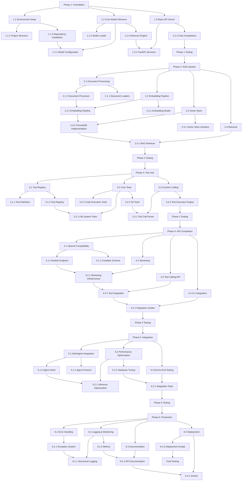

# HelixLLM + HelixAgent Integration - Visual Timeline & Dependencies

## Gantt Chart Timeline



## Dependency Graph



## Critical Path Analysis


## Milestone Timeline

| Week | Milestone | Key Deliverables | Success Criteria |
|------|-----------|------------------|------------------|
| 1 | Foundation Complete | Project structure, Model inference, Basic API | Server responds, Model loads, >50 t/s |
| 2 | RAG System Complete | Document processing, Embeddings, Retrieval | <100ms retrieval, Relevant results |
| 3 | Tool System Complete | Tool registry, Core tools, Execution engine | All tools work, Security OK |
| 4 | API Complete | OpenAI compatibility, Streaming, Tool calling | All CLI agents connect |
| 5 | Integration Complete | HelixAgent, Optimization, E2E tests | >150 t/s, Integration works |
| 6 | Production Ready | Error handling, Logging, Documentation, Deployment | Production deployment ready |

## Resource Allocation

```
Development Effort by Phase:
- Phase 1: Foundation       15%
- Phase 2: RAG System       18%
- Phase 3: Tool Use         20%
- Phase 4: API Completion   17%
- Phase 5: Integration      16%
- Phase 6: Production       14%
```

## Risk Heat Map

```
Impact
  High |  [Model Loading]    [Performance]    [Memory]
       |        [RAG Speed]
  Med  |  [Dependencies]      [Documentation]
       |
  Low  |  [Code Style]
       |
       +-------------------------------------------
            Low        Med         High
                    Probability
```

Legend:
- [Model Loading] = Hardware compatibility risks
- [Performance] = Not meeting 150-300 t/s target
- [Memory] = Excessive memory usage
- [RAG Speed] = Retrieval latency too high
- [Dependencies] = Package conflicts
- [Documentation] = Incomplete docs
- [Code Style] = Consistency issues
