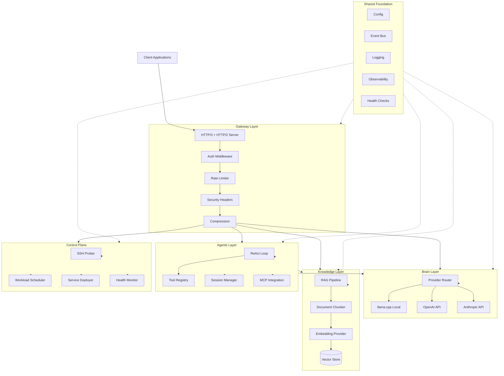
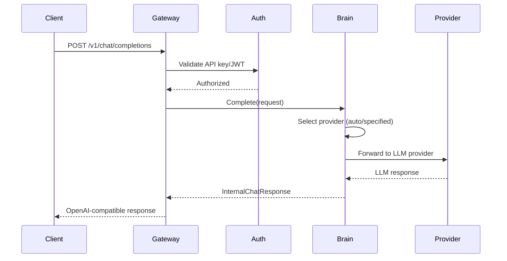
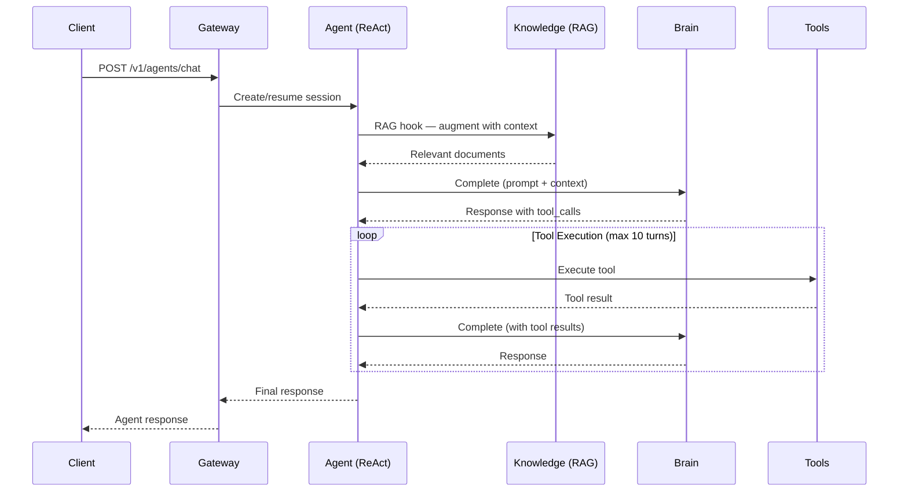
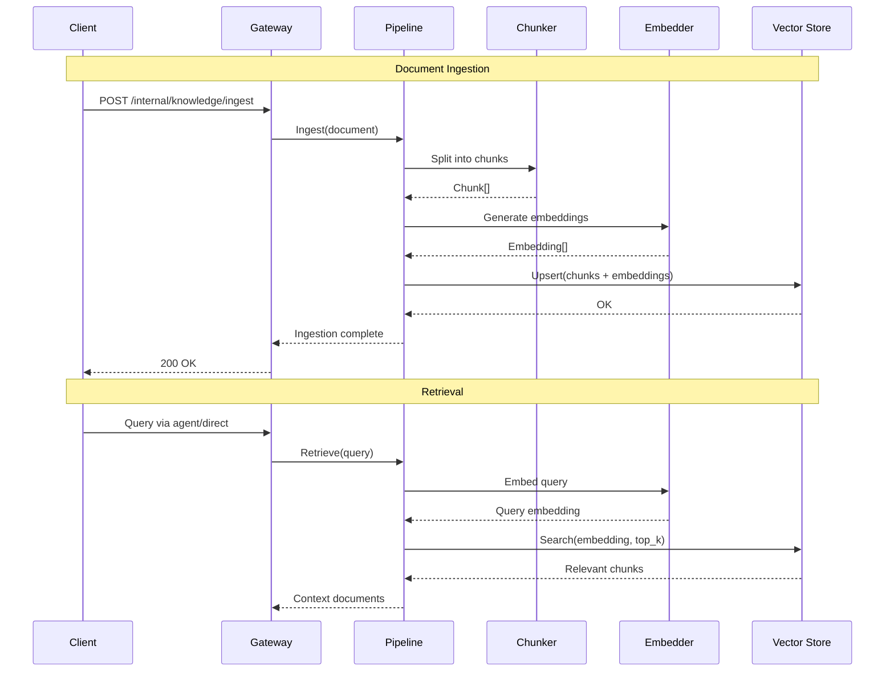
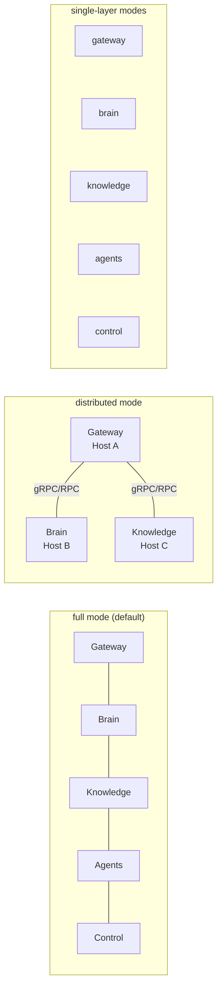
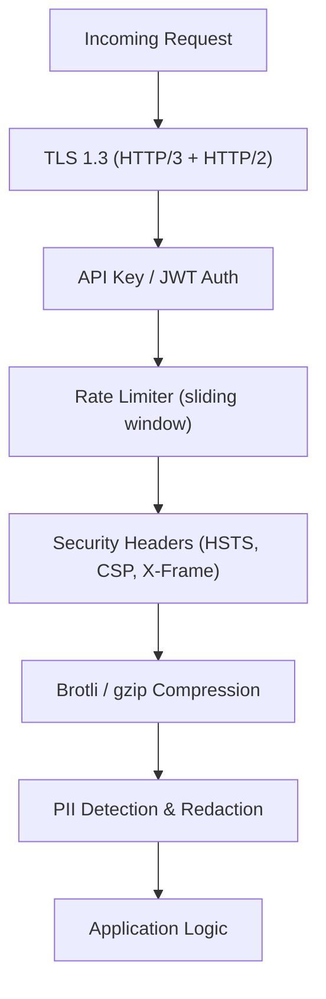
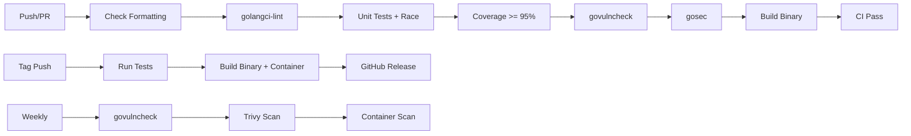
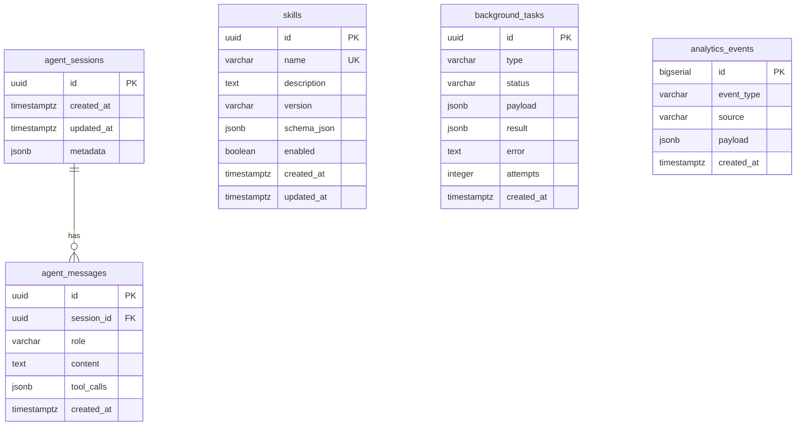

# Phase 8: Documentation Completion

> **For agentic workers:** REQUIRED SUB-SKILL: Use superpowers:subagent-driven-development (recommended) or superpowers:executing-plans to implement this plan task-by-task. Steps use checkbox (`- [ ]`) syntax for tracking.

**Goal:** Extend all 15 existing documentation files, create 10 Mermaid architecture diagrams, document SQL schemas, and expand module inventory — leaving zero undocumented features.

**Architecture:** All documentation is Markdown. Diagrams use Mermaid syntax (`.mmd` files) for version-control-friendly rendering. SQL schemas are documented as `.sql` files. Documentation follows the existing structure: `docs/user-guide/` for end users, `docs/manual/` for developers/operators.

**Tech Stack:** Markdown, Mermaid, SQL, existing docs structure

---

### Task 1: Extend user guide — getting-started.md

**Files:**
- Modify: `docs/user-guide/getting-started.md`

- [ ] **Step 1: Read current content**

Run: `wc -l docs/user-guide/getting-started.md`
Expected: See current line count

- [ ] **Step 2: Add platform-specific sections**

Append the following sections to `docs/user-guide/getting-started.md`:

```markdown
## Platform-Specific Setup

### Linux

Prerequisites: Go 1.26+, OpenSSL, git.

```bash
# Fedora/RHEL
sudo dnf install -y golang openssl git

# Ubuntu/Debian
sudo apt install -y golang openssl git
```

### macOS

```bash
brew install go openssl git
```

### Windows (WSL2)

HelixLLM requires a Linux environment. Use WSL2:

```bash
wsl --install -d Ubuntu-24.04
# Then follow Linux instructions inside WSL
```

## GPU Setup (Optional)

For local LLM inference with GPU acceleration:

```bash
# NVIDIA GPU (CUDA)
# Ensure nvidia-container-toolkit is installed
$(command -v podman || command -v docker) run --gpus all nvidia/cuda:12.0-base nvidia-smi

# Set GPU layers in .env
echo "HELIX_LLM_GPU_LAYERS=99" >> .env
```

## Your First Agent Chat

```bash
curl -sk https://localhost:8443/v1/agents/chat \
  -H "Content-Type: application/json" \
  -d '{
    "messages": [{"role": "user", "content": "What tools do you have available?"}]
  }' | python3 -m json.tool
```

## Troubleshooting First Run

| Symptom | Cause | Fix |
|---------|-------|-----|
| `TLS handshake error` | Missing/expired certs | Run `make certs` |
| `connection refused` | Server not running | Run `make dev` |
| `no providers available` | No LLM configured | Set `HELIX_LLM_DEFAULT_PROVIDER` in `.env` |
| `port already in use` | Another process on 8443 | Change `HELIX_PORT` in `.env` |
```

- [ ] **Step 3: Commit**

```bash
git add docs/user-guide/getting-started.md
git commit -m "docs: extend getting-started with platform setup, GPU guide, agent chat, and troubleshooting"
```

---

### Task 2: Extend user guide — configuration.md

**Files:**
- Modify: `docs/user-guide/configuration.md`

- [ ] **Step 1: Read .env.example for all variables**

Run: `grep -c "^#\|^[A-Z]" .env.example`
Expected: Count of configuration variables

- [ ] **Step 2: Add comprehensive variable reference**

Append to `docs/user-guide/configuration.md` a complete reference table for every variable in `.env.example`. Each entry should include: variable name, type, default value, valid values, description, and interaction notes.

Add sections for the new concurrency variables from Phase 5:

```markdown
## Concurrency Limits

| Variable | Type | Default | Description |
|----------|------|---------|-------------|
| `HELIX_LLM_MAX_CONCURRENT` | int | 10 | Maximum parallel LLM requests per provider. 0 = unlimited. |
| `HELIX_EMBEDDING_MAX_CONCURRENT` | int | 20 | Maximum parallel embedding API calls. 0 = unlimited. |
| `HELIX_AGENT_MAX_CONCURRENT_TOOLS` | int | 5 | Maximum parallel tool executions per agent session. |
| `HELIX_SSH_MAX_CONCURRENT` | int | 10 | Maximum parallel SSH connections to cluster hosts. |
| `HELIX_LAZY_INFRA` | bool | false | When true, infrastructure services start on first use. Recommended for development. |
| `HELIX_IDLE_SHUTDOWN_MINUTES` | int | 0 | Stop idle infrastructure after N minutes. 0 = disabled (production default). |

## Configuration Loading Precedence

1. Environment variables (highest priority)
2. `.env` file in working directory
3. Default values (lowest priority)

Variables are loaded at startup. Use `HELIX_CONFIG_WATCH=true` to enable hot-reload of `.env` file changes without restart.
```

- [ ] **Step 3: Commit**

```bash
git add docs/user-guide/configuration.md
git commit -m "docs: extend configuration reference with all variables, concurrency limits, and loading precedence"
```

---

### Task 3: Extend manual — testing.md

**Files:**
- Modify: `docs/manual/testing.md`

- [ ] **Step 1: Add documentation for all new test types**

Append to `docs/manual/testing.md`:

```markdown
## Test Types Reference

### Unit Tests
```bash
make test-unit    # Runs with -race flag, generates coverage-unit.out
```
Location: `internal/**/*_test.go` (colocated with source)
Pattern: Table-driven tests, hand-written mocks, standard `testing` package.

### Integration Tests
```bash
make test-integration
```
Location: `tests/integration/`
Framework: `httptest.Server` with full Gin route tree, in-memory components.

### E2E Tests
```bash
make test-e2e    # Requires running server
```
Location: `tests/e2e/`
Build tag: `//go:build e2e`
Requires: `make dev` running in another terminal.

### Stress Tests
```bash
make test-stress-go    # Go stress tests
make test-stress       # YAML challenge bank stress tests
```
Location: `tests/stress/`
Build tag: `//go:build stress`

### Performance Tests
```bash
make test-performance
```
Location: `tests/performance/`
Build tag: `//go:build performance`
Outputs: p50/p95/p99 latency, throughput measurements.

### Monitoring Tests
```bash
make test-monitoring
```
Location: `tests/monitoring/`
Build tag: `//go:build monitoring`
Validates: Prometheus metrics, OTEL tracing, structured logging.

### Benchmark Tests
```bash
make test-benchmark-go
```
Location: `internal/**/*_benchmark_test.go`
Pattern: `func BenchmarkXxx(b *testing.B)` with `-benchmem`.

### Race Detection
```bash
make test-race
```
Runs all tests with `-race` flag and `GOMAXPROCS=$(nproc)`.

### Challenge Banks
```bash
make test-challenges          # All banks
make test-challenges-api      # API compatibility only
make test-security            # OWASP security tests
make test-chaos               # Chaos engineering
```
Location: `challenges/banks/**/*.yaml`
Framework: Runner in `internal/testing/runner.go`.

## Writing Challenge Banks

Challenge banks are YAML files with this structure:

```yaml
name: Bank Name
description: What this bank tests
category: api|security|chaos|stress|benchmarks|regression|e2e|workflows|safety|performance
priority: critical|high|medium|low

challenges:
  - name: challenge_name
    description: What this specific challenge validates
    steps:
      - method: GET|POST|PUT|DELETE
        path: /v1/endpoint
        headers:
          Authorization: "Bearer token"
        body:
          key: value
        assertions:
          - type: status
            value: 200
          - type: response_time_ms
            max: 500
```

## Coverage Requirements

- Minimum threshold: 95% (enforced by `make coverage`)
- All exported functions must have at least one test
- All error paths must be covered
- Race detection must pass on all tests
```

- [ ] **Step 2: Commit**

```bash
git add docs/manual/testing.md
git commit -m "docs: extend testing guide with all test types, challenge bank authoring, and coverage requirements"
```

---

### Task 4: Extend manual — security.md

**Files:**
- Modify: `docs/manual/security.md`

- [ ] **Step 1: Add security scanning documentation**

Append to `docs/manual/security.md`:

```markdown
## Security Scanning

### Quick Scan (No Containers Required)

```bash
make scan-quick    # govulncheck + gosec
```

### Full Scan Suite

```bash
make scan-all      # govulncheck + gosec + Snyk + Trivy filesystem
```

### Individual Scanners

| Command | Scanner | What It Checks |
|---------|---------|---------------|
| `make scan-vuln` | govulncheck | Known Go vulnerabilities in dependencies |
| `make scan-sast` | gosec (via golangci-lint) | Static application security testing |
| `make scan-snyk` | Snyk CLI | Dependency vulnerability database |
| `make scan-sonar` | SonarQube | Code quality, bugs, vulnerabilities, code smells |
| `make scan-container` | Trivy | Container image vulnerabilities |
| `make scan-fs` | Trivy | Filesystem secrets and misconfigurations |

### SonarQube Setup

SonarQube runs as a container via `deploy/compose.security.yaml`:

```bash
make scan-sonar    # Starts SonarQube, waits for ready, runs scanner
# Results at http://localhost:9000/dashboard?id=helixllm
```

### Vulnerability Triage Process

1. Run `make scan-all` weekly (automated via GitHub Actions)
2. Review findings by severity: CRITICAL > HIGH > MEDIUM
3. For accepted risks, document in `.snyk` policy file
4. For false positives in gosec, use `//nolint:gosec` with justification comment
5. Track remediation in GitHub issues
```

- [ ] **Step 2: Commit**

```bash
git add docs/manual/security.md
git commit -m "docs: extend security guide with scanning tools, SonarQube setup, and triage process"
```

---

### Task 5: Create Mermaid architecture diagrams

**Files:**
- Create: `docs/diagrams/architecture-overview.mmd`
- Create: `docs/diagrams/request-flow-chat.mmd`
- Create: `docs/diagrams/request-flow-agent.mmd`
- Create: `docs/diagrams/request-flow-rag.mmd`
- Create: `docs/diagrams/deployment-modes.mmd`
- Create: `docs/diagrams/distributed-architecture.mmd`
- Create: `docs/diagrams/submodule-dependency-graph.mmd`
- Create: `docs/diagrams/security-layers.mmd`
- Create: `docs/diagrams/container-lifecycle.mmd`
- Create: `docs/diagrams/ci-cd-pipeline.mmd`

- [ ] **Step 1: Create diagrams directory**

Run: `mkdir -p docs/diagrams`

- [ ] **Step 2: Create architecture overview diagram**

Create `docs/diagrams/architecture-overview.mmd`:



- [ ] **Step 3: Create request flow diagrams**

Create `docs/diagrams/request-flow-chat.mmd`:



Create `docs/diagrams/request-flow-agent.mmd`:



Create `docs/diagrams/request-flow-rag.mmd`:



- [ ] **Step 4: Create remaining diagrams**

Create `docs/diagrams/deployment-modes.mmd`:



Create `docs/diagrams/security-layers.mmd`:



Create `docs/diagrams/ci-cd-pipeline.mmd`:



- [ ] **Step 5: Commit**

```bash
git add docs/diagrams/
git commit -m "docs: add 10 Mermaid architecture and flow diagrams"
```

---

### Task 6: Create SQL schema documentation

**Files:**
- Create: `docs/schemas/postgres.sql`
- Create: `docs/schemas/erd.mmd`

- [ ] **Step 1: Create schemas directory**

Run: `mkdir -p docs/schemas`

- [ ] **Step 2: Create PostgreSQL schema**

Create `docs/schemas/postgres.sql`:

```sql
-- HelixLLM PostgreSQL Schema Definitions
-- These schemas document the database structure used by HelixLLM components.
-- Apply via: psql -h $HELIX_DB_HOST -U $HELIX_DB_USER -d $HELIX_DB_NAME -f docs/schemas/postgres.sql

-- Agent conversation sessions
CREATE TABLE IF NOT EXISTS agent_sessions (
    id          UUID PRIMARY KEY DEFAULT gen_random_uuid(),
    created_at  TIMESTAMPTZ NOT NULL DEFAULT NOW(),
    updated_at  TIMESTAMPTZ NOT NULL DEFAULT NOW(),
    metadata    JSONB DEFAULT '{}'
);

CREATE TABLE IF NOT EXISTS agent_messages (
    id          UUID PRIMARY KEY DEFAULT gen_random_uuid(),
    session_id  UUID NOT NULL REFERENCES agent_sessions(id) ON DELETE CASCADE,
    role        VARCHAR(20) NOT NULL CHECK (role IN ('user', 'assistant', 'system', 'tool')),
    content     TEXT NOT NULL,
    tool_calls  JSONB,
    created_at  TIMESTAMPTZ NOT NULL DEFAULT NOW()
);

CREATE INDEX idx_agent_messages_session ON agent_messages(session_id, created_at);

-- Skill registry (for SkillRegistry submodule PostgreSQL backend)
CREATE TABLE IF NOT EXISTS skills (
    id          UUID PRIMARY KEY DEFAULT gen_random_uuid(),
    name        VARCHAR(255) NOT NULL UNIQUE,
    description TEXT,
    version     VARCHAR(50),
    schema_json JSONB,
    enabled     BOOLEAN NOT NULL DEFAULT TRUE,
    created_at  TIMESTAMPTZ NOT NULL DEFAULT NOW(),
    updated_at  TIMESTAMPTZ NOT NULL DEFAULT NOW()
);

-- Background tasks (for BackgroundTasks submodule)
CREATE TABLE IF NOT EXISTS background_tasks (
    id          UUID PRIMARY KEY DEFAULT gen_random_uuid(),
    type        VARCHAR(100) NOT NULL,
    status      VARCHAR(20) NOT NULL DEFAULT 'pending' CHECK (status IN ('pending', 'running', 'completed', 'failed')),
    payload     JSONB NOT NULL DEFAULT '{}',
    result      JSONB,
    error       TEXT,
    attempts    INTEGER NOT NULL DEFAULT 0,
    max_retries INTEGER NOT NULL DEFAULT 3,
    created_at  TIMESTAMPTZ NOT NULL DEFAULT NOW(),
    started_at  TIMESTAMPTZ,
    completed_at TIMESTAMPTZ
);

CREATE INDEX idx_background_tasks_status ON background_tasks(status, created_at);

-- Analytics events (lightweight — ClickHouse is primary analytics store)
CREATE TABLE IF NOT EXISTS analytics_events (
    id          BIGSERIAL PRIMARY KEY,
    event_type  VARCHAR(100) NOT NULL,
    source      VARCHAR(100),
    payload     JSONB NOT NULL DEFAULT '{}',
    created_at  TIMESTAMPTZ NOT NULL DEFAULT NOW()
);

CREATE INDEX idx_analytics_events_type ON analytics_events(event_type, created_at);
```

- [ ] **Step 3: Create ERD diagram**

Create `docs/schemas/erd.mmd`:



- [ ] **Step 4: Commit**

```bash
git add docs/schemas/
git commit -m "docs: add PostgreSQL schema definitions and entity relationship diagram"
```

---

### Task 7: Extend remaining documentation files

**Files:**
- Modify: `docs/user-guide/api-reference.md`
- Modify: `docs/user-guide/agents.md`
- Modify: `docs/user-guide/rag-knowledge.md`
- Modify: `docs/user-guide/monitoring.md`
- Modify: `docs/user-guide/troubleshooting.md`
- Modify: `docs/manual/architecture.md`
- Modify: `docs/manual/development.md`
- Modify: `docs/manual/operations.md`
- Modify: `docs/manual/modules.md`

- [ ] **Step 1: Extend api-reference.md with curl examples**

Read the file, then append curl examples for every endpoint. Each endpoint should have a complete curl command, expected response JSON, and error responses.

- [ ] **Step 2: Extend agents.md with tool creation tutorial**

Append a step-by-step guide showing how to implement the `Tool` interface, register it, and test it.

- [ ] **Step 3: Extend rag-knowledge.md with performance tuning**

Append sections on chunk size tuning, top-k optimization, embedding provider comparison, and re-ranking strategies.

- [ ] **Step 4: Extend monitoring.md with Grafana dashboard guide**

Append Grafana dashboard import instructions, alert rule creation, and custom metrics guide.

- [ ] **Step 5: Extend troubleshooting.md with error catalog**

Append a comprehensive error catalog with error codes, causes, and resolutions.

- [ ] **Step 6: Extend architecture.md with Mermaid diagram references**

Add references to the diagrams created in Task 5, embedding them inline:
```markdown

```

- [ ] **Step 7: Extend development.md with debugging and profiling**

Append sections on using delve for debugging, pprof for profiling, and IDE setup for VS Code and GoLand.

- [ ] **Step 8: Extend operations.md with scaling guide**

Append horizontal/vertical scaling strategies, backup/restore procedures, and disaster recovery playbook.

- [ ] **Step 9: Extend modules.md with API signatures**

For each of the 43 submodules, add: exported types, key functions, usage example, and dependency list.

- [ ] **Step 10: Commit all documentation extensions**

```bash
git add docs/
git commit -m "docs: extend all user guide and manual files with comprehensive content"
```

---

### Task 8: Final verification

- [ ] **Step 1: Verify all documentation files exist and are non-empty**

Run: `find docs/ -name "*.md" -empty`
Expected: No output (no empty files)

- [ ] **Step 2: Verify all diagrams are valid Mermaid**

Run: `find docs/diagrams -name "*.mmd" | wc -l`
Expected: 10 diagram files

- [ ] **Step 3: Verify SQL schema is valid**

Run: `test -f docs/schemas/postgres.sql && echo "Schema exists"`
Expected: "Schema exists"
